# Build a Cozy Farming Game in Godot 4

## Part 1 -- Character Movement & Your First Farm Scene

> **What you'll build:** A playable prototype with a modular animated
> character, a following camera, and a small farm scene that already
> feels like the beginning of a cozy game.

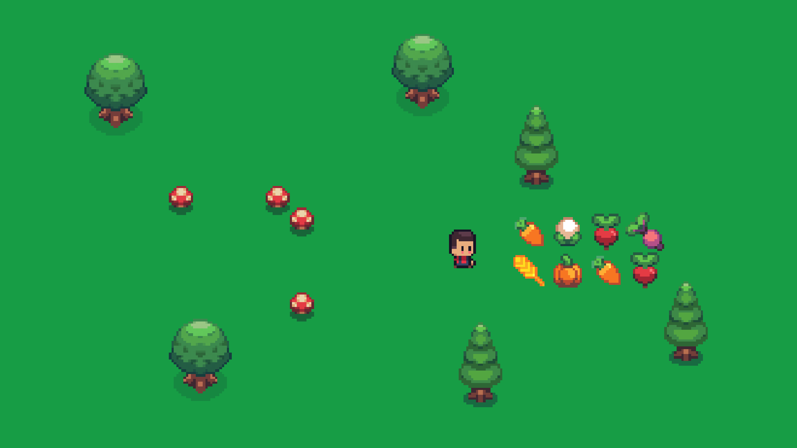

------------------------------------------------------------------------

# Project Setup

## Engine

-   **Godot 4.x**

## Asset Pack

This series uses **Sunnyside World** by Daniel Diggle.

Download: https://danieldiggle.itch.io/sunnyside

The pack includes modular characters, animated decorations, crops,
terrain, UI, and everything we'll need throughout the series.

Huge thanks to Daniel Diggle for creating such an excellent asset pack.
Please follow the included license when using it.

## Source Code

GitHub: https://github.com/jpDxsolo/cozyfarm

------------------------------------------------------------------------

# Series Roadmap

-   ✅ Part 1 -- Character Movement & First Farm Scene
-   ⬜ Part 2 -- Building Your First TileMap
-   ⬜ Part 3 -- World Interaction
-   ⬜ Part 4 -- Farming
-   ⬜ Part 5 -- Inventory
-   ⬜ Part 6 -- NPCs & Dialogue
-   ⬜ Part 7 -- Saving & Loading

------------------------------------------------------------------------

# Before You Begin

Throughout this series every section ends with a **Checkpoint**.

If your project doesn't match the checkpoint, stop and fix it before
moving on. It is much easier to correct mistakes immediately than
several chapters later.

------------------------------------------------------------------------

# 1. Understand the Character

Before building anything, it helps to know how this asset pack expects a
character to be put together.

The character is **modular**. The body and the hair are two separate
`AnimatedSprite2D` nodes stacked on top of each other, not one combined sprite.
That's what lets you change hairstyle later without redrawing anything — and
it's why our movement script has to drive *both* sprites in lockstep.

The animations are more economical than you might expect:

-   There is a single **side-facing** walk animation.
-   Walking **left** reuses it with `flip_h` turned on.
-   Walking **up** and **down** reuse it too — no separate animations.

So four directions of movement come from one animation plus a boolean. The pack
also ships tool, fishing and chopping animations; we'll reach for those in
later parts.

------------------------------------------------------------------------

# 2. Create the Player Scene

    Player (CharacterBody2D)
    ├── BaseSprite (AnimatedSprite2D)
    ├── HairSprite (AnimatedSprite2D)
    ├── CollisionShape2D
    └── Camera2D

Leave the collision shape empty for now.

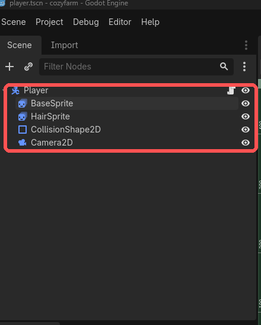

### ✅ Checkpoint

You should have the node tree above with no errors.

------------------------------------------------------------------------

# 3. Configure BaseSprite

Create a SpriteFrames resource.

Create:

-   `walk`
-   `idle`

Import the matching body sprite strips.

The strips are single-row sprite sheets, so each frame is a slice of one
image. Frame size is **96 x 64**.

-   `idle` -- `base_idle_strip9.png`, **9 frames**
-   `walk` -- `base_walk_strip8.png`, **8 frames**

Configure both:

-   1 row
-   Loop enabled
-   12 FPS

> The number at the end of each filename tells you the frame count.
> `strip9` means 9 frames, `strip8` means 8.

> **💡 Tip**
>
> A new SpriteFrames resource always starts with an empty animation called
> `default`. You'll see it listed alongside `idle` and `walk` — leave it or
> delete it, it makes no difference as long as the script never asks for it.

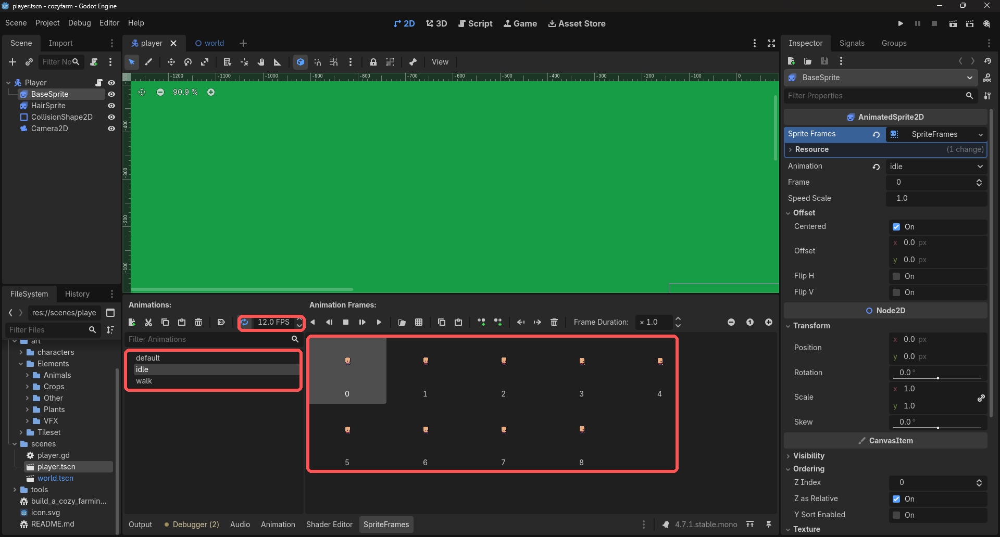

### ✅ Checkpoint

-   Body visible.
-   Walk previews.
-   Idle previews.

------------------------------------------------------------------------

# 4. Configure HairSprite

Repeat the exact same process for your chosen hairstyle.

Keep both sprites at `(0, 0)`.

The body carries the character; the hair is a separate sprite drawn on top of
it. Because both play the same animation names in lockstep, you can swap
hairstyles later without touching the movement code at all.

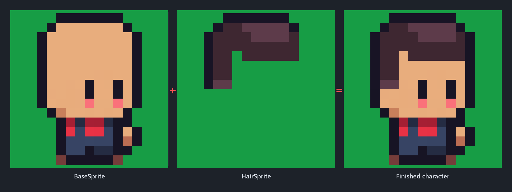

### ✅ Checkpoint

The finished player should look correct.

------------------------------------------------------------------------

# 5. Configure Collision

Now that the player is visible, add a `RectangleShape2D`.

Keep the collision around the feet instead of the whole body.

The values used here are:

-   Size: **9 x 2**
-   Position: **(0.5, 6)**

That height of `2` looks alarmingly thin in the Inspector, but it is doing
exactly what we want: it is a *footprint*, not a body. Anywhere from `2` to `8`
feels fine — go lower for tighter, more precise movement around scenery, higher
if you want the player stopped further from it. Adjust visually.

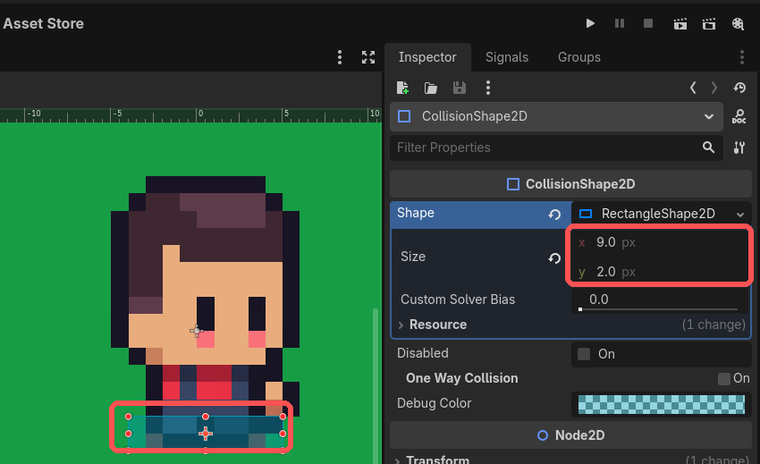

> **📌 Why this matters**
>
> A collision box that covers the whole sprite makes a top-down character feel
> like a fridge. Keeping it at the feet is what lets the player tuck in behind
> trees and walk close to scenery without snagging on it.

### ✅ Checkpoint

The collision only covers the player's feet.

------------------------------------------------------------------------

# 6. Configure Input

Create:

-   move_up
-   move_down
-   move_left
-   move_right

Bind WASD and the arrow keys.

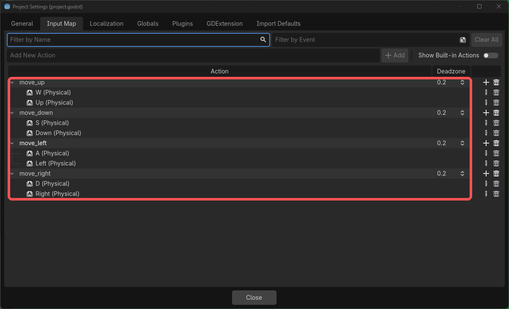

### ✅ Checkpoint

All four actions exist in the Input Map.

------------------------------------------------------------------------

# 7. Add Movement & Animation

Attach a script to the `Player` node:

``` gdscript
extends CharacterBody2D

@export var speed := 100.0

@onready var base_sprite = $BaseSprite
@onready var hair_sprite = $HairSprite

func _ready():
	play_character_animation("idle")

func _physics_process(delta: float):
	var direction = Input.get_vector("move_left", "move_right", "move_up", "move_down")

	velocity = direction * speed
	move_and_slide()

	update_animation(direction)

func play_character_animation(name: StringName):
	if base_sprite.animation != name:
		base_sprite.play(name)

	if hair_sprite.animation != name:
		hair_sprite.play(name)

func update_animation(direction):
	if direction != Vector2.ZERO:
		if direction.x < 0:
			base_sprite.flip_h = true
			hair_sprite.flip_h = true
		elif direction.x > 0:
			base_sprite.flip_h = false
			hair_sprite.flip_h = false

		play_character_animation("walk")
	else:
		play_character_animation("idle")
```

Three things are worth pulling out of that.

**`Input.get_vector()` does the hard part.** It reads all four actions and hands
back a direction vector that's already normalised, so diagonal movement isn't
faster than straight movement — a bug you'd otherwise have to find and fix.

**`play_character_animation()` drives both sprites.** It's the one place that
knows the character is made of two layers. The `if` guards matter: calling
`play()` every frame would restart the animation every frame, and the character
would freeze on frame 0.

**`_ready()` is what starts the idle.** `AnimatedSprite2D` does not begin
animating on its own — until `play()` is called it just displays whichever frame
it's currently on.

There is no separate "walk left" animation. Left is the *same* walk animation
with `flip_h` turned on for both sprites, which is what `update_animation()`
is doing:

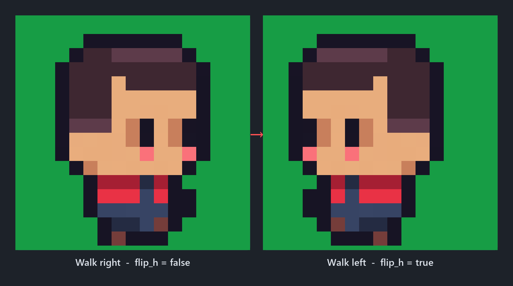

> **⚠️ Common mistake**
>
> Player not animating? Check that `_ready()` calls
> `play_character_animation("idle")`. Setting the animation in the Inspector
> only picks which one is *selected* — it doesn't start playback.

### ✅ Checkpoint

The player is already idling before you press any keys.

------------------------------------------------------------------------

# 8. Build a Tiny Test Farm

Create:

    World (Node2D)
    ├── Grass         (Node2D)
    ├── Decorations   (Node2D)
    ├── Crops         (Node2D)
    └── Player        (instance of player.tscn)

`Grass`, `Decorations` and `Crops` are plain `Node2D`s used purely as folders.
They'll stay empty-ish for now — grouping things from the start means Part 2 has
somewhere obvious to put the tilemap without a reshuffle.

Use a simple green background for now. The quickest way is
**Project Settings > Rendering > Environment > Default Clear Color**.

Add one or two animated trees (or mushrooms) using `AnimatedSprite2D`. The
setup is identical to the player's — a SpriteFrames resource with the strip
sliced into frames:

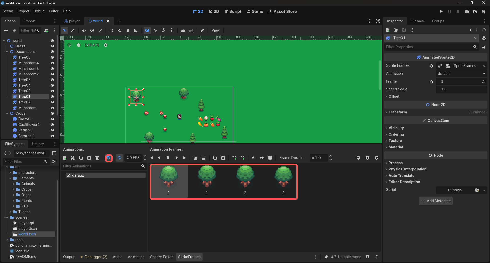

Enable looping and either:

-   turn on **Autoplay on Load** (the ▶ button in the SpriteFrames panel), or
-   call `play()` on it inside `_ready()`.

Autoplay is the easier option here, and it's why the decorations animate in the
editor as well as at runtime. Note the tree's animation is called `default` —
these decorations only have one animation, so there's no reason to rename it.

Once those work, decorate the scene with anything else from the asset
pack that you like:

-   rocks
-   crates
-   flowers
-   crops
-   fences
-   signs

Don't spend too much time here---this scene is temporary and will be
replaced with a proper TileMap in Part 2.

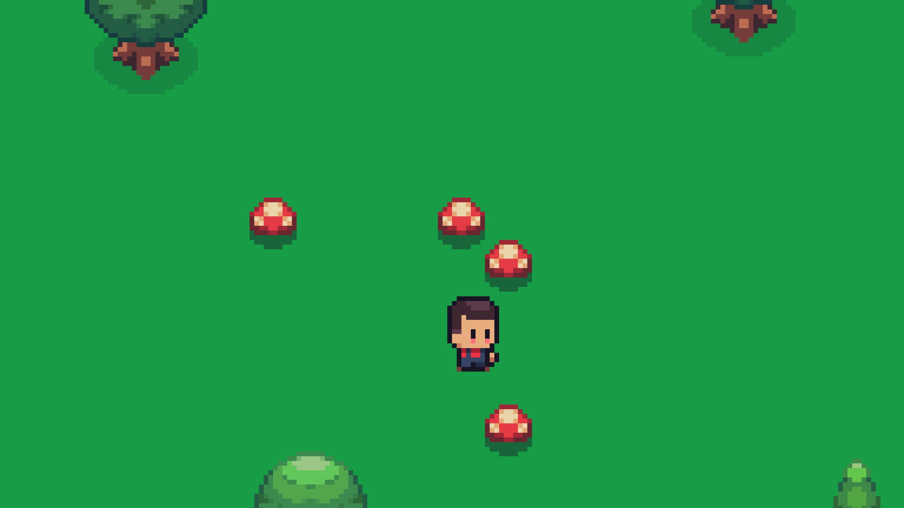

> **📌 Why this matters**
>
> We aren't using a TileMap yet because placing decorations by hand keeps the
> focus on movement. All that empty green is deliberate — Part 2 replaces it
> with a real tile-based map.

### ✅ Checkpoint

-   Background isn't gray.
-   Animated decorations move immediately.
-   You have a few landmarks to walk around.

------------------------------------------------------------------------

# 9. Make It Feel Cozy

Enable the Camera2D.

Try:

    Zoom
    X: 4
    Y: 4

Adjust until it feels comfortable.

Zoom `1` — the character is lost on screen:

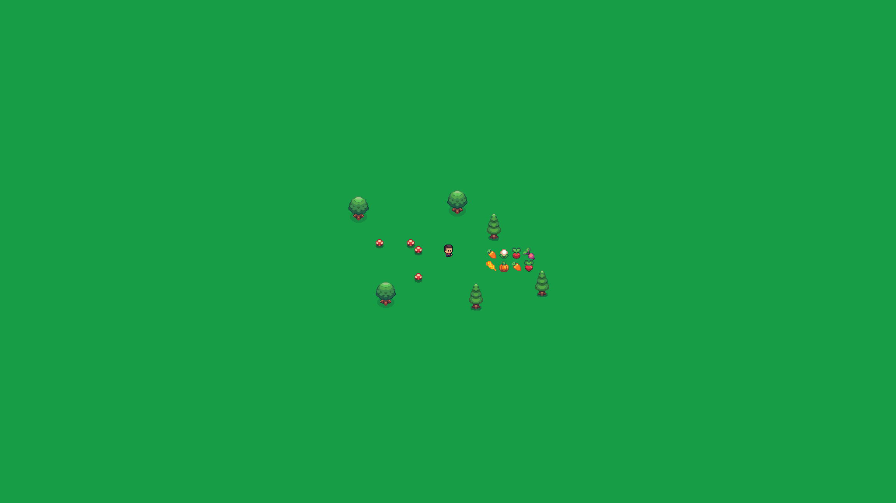

Zoom `4` — cozy:

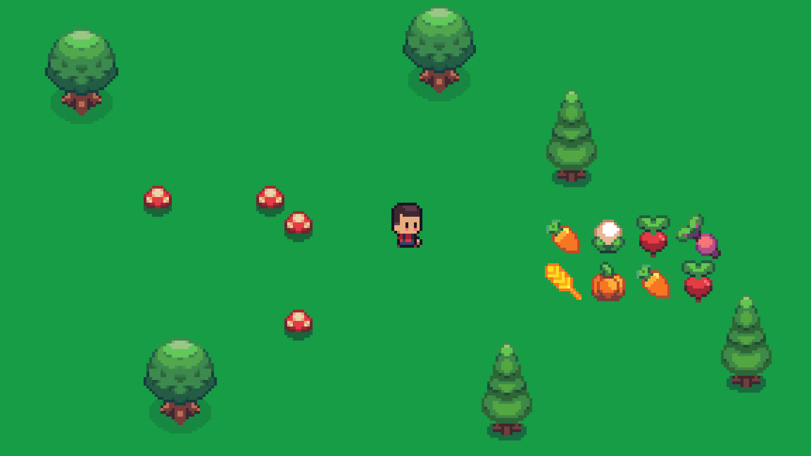

### ✅ Checkpoint

The character fills a reasonable amount of the screen and the camera
follows smoothly.

------------------------------------------------------------------------

# 10. Final Review

Before moving on to Part 2:

-   [x] Character renders correctly.
-   [x] Body and hair stay synchronized.
-   [x] Idle starts automatically.
-   [x] Walk animation works.
-   [x] Left flips correctly.
-   [x] Camera follows the player.
-   [x] Decorations animate automatically.
-   [x] The prototype feels like a tiny game, not just a tech demo.

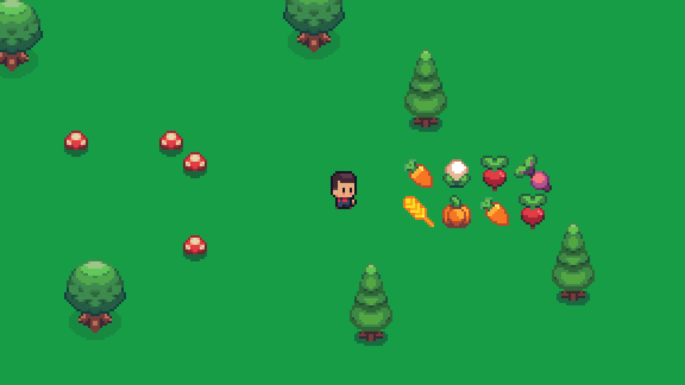

------------------------------------------------------------------------

# Next Time

Now that movement is finished, we've hit the first pain point:

Building terrain by hand doesn't scale.

In **Part 2** we'll solve that by introducing Godot's TileSet and
TileMapLayer systems, replacing our temporary scene with a real farm
that we can continue expanding throughout the rest of the series.
